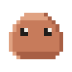

# Context Meter for Stream Deck

A real-time token/context usage meter for [Claude Code](https://claude.ai/code), shown on your Elgato Stream Deck. An animated character reacts as Claude Code works — thinking, generating, finishing — and a bar fills as your context grows, all driven by Claude Code's hook system.



---

## What it does

| State | Character | Trigger |
|---|---|---|
| **Thinking** | Eyes up, bouncing dots | Before each tool call |
| **Generating** | Mouth open, typing bars + token count | After each tool call |
| **Success** | Wide eyes, sparkles, then dozes off | Session ends |
| **Idle / sleeping** | Gentle bob, then ZZZ | No active session |
| **Press key** | Resets to zero | Manual reset |

A bar across the bottom of the key fills as you consume Claude Code's context window (cap: 200k tokens).
Pick from several characters — or import your own — in the key's settings (see [Characters](#characters)).

---

## Requirements

- [Elgato Stream Deck](https://www.elgato.com/stream-deck) hardware
- [Stream Deck software](https://www.elgato.com/downloads) 6.4+
- [Claude Code](https://claude.ai/code) CLI
- Node.js 20+ (for building; Stream Deck ships its own runtime)
- bash + Python 3 (for hooks — standard on macOS, available via Git Bash on Windows)

---

## Installation

### 1. Clone and build

```bash
git clone https://github.com/mishigo-co/context-meter-for-stream-deck
cd context-meter-for-stream-deck
npm install
npm run build
```

### 2. Link the plugin to Stream Deck

```bash
npx streamdeck link com.mishigo.context-meter.sdPlugin
npx streamdeck dev   # enables developer mode (one-time)
```

Then restart the Stream Deck app. The **Context Meter** action will appear in your actions list — drag it onto a key.

### 3. Wire up the hooks

Add the following to your `~/.claude/settings.json`:

```json
{
  "hooks": {
    "PreToolUse": [
      {
        "matcher": "",
        "hooks": [{ "type": "command", "command": "bash /path/to/context-meter-for-stream-deck/hooks/pre-tool-use.sh" }]
      }
    ],
    "PostToolUse": [
      {
        "matcher": "",
        "hooks": [{ "type": "command", "command": "bash /path/to/context-meter-for-stream-deck/hooks/post-tool-use.sh" }]
      }
    ],
    "Stop": [
      {
        "hooks": [{ "type": "command", "command": "bash /path/to/context-meter-for-stream-deck/hooks/stop.sh" }]
      }
    ]
  }
}
```

Replace `/path/to/context-meter-for-stream-deck` with your actual clone path. Restart Claude Code for hooks to take effect.

---

## How it works

```
Claude Code lifecycle hooks
         │
         ▼
  HTTP POST → localhost:3141/update
         │
         ▼
  Plugin HTTP server (server.ts)
         │
         ▼
  ContextMeterAction state update
         │
         ▼
  50ms tick → renderCharacter() → setImage()
         │
         ▼
  Stream Deck key display
```

Three hooks drive the meter:

- **`pre-tool-use.sh`** — Fires before every tool call. Sends `{ isThinking: true }` → the character starts thinking.
- **`post-tool-use.sh`** — Fires after every tool call. Parses the token count from stdin and sends `{ tokens: N }` → fills the bar.
- **`stop.sh`** — Fires on session end or `/clear`. Sends the final token count or resets to idle.

The plugin runs a lightweight HTTP server on `127.0.0.1:3141`. The hooks are the only clients — nothing is sent to any external service.

---

## Development

```bash
npm run watch        # rebuild on file changes
npx streamdeck restart com.mishigo.context-meter   # restart plugin after rebuild
```

### Customisation

**Animation speed** — in `src/utils/renderCharacter.ts`, change the phase increment in the
50 ms tick (`src/actions/meter.ts`):

```typescript
this.phase = (this.phase + 0.02) % 1;  // smaller = slower
```

For colours and the character itself, see **Characters** below.

---

## Characters

The animated face is a **character pack** — a small JSON file holding a 12×12 base silhouette and a
colour palette. The face expressions and motion (blink, thinking dots, Z's, sparkles, typing bars)
are shared in code, so every character animates the same way; packs only change the body shape and
colours.

**Pick a character** — select the key in Stream Deck and use the **Character** dropdown in the
property inspector. Seven are bundled: Ember, Robo, Cat, Ghost, Slime, Alien, Pumpkin.

**Import your own** — click **Import character…** in the property inspector and choose a `.json` pack.
Imported packs are stored in the plugin's global settings (no files to manage) and appear in the
dropdown for every key. Bad files are rejected with an inline error.

**Pack format** (`schema: 1`):

```jsonc
{
  "schema": 1,
  "id": "robo",            // unique id; re-importing the same id replaces it
  "name": "Robo",          // shown in the dropdown
  "palette": {             // all nine roles required, each a #rrggbb hex
    "bg": "#000000", "body": "#22AACC", "shade": "#116688", "hilit": "#66E0FF",
    "white": "#FFFFFF", "pupil": "#001824", "dark": "#002A38", "gray": "#557788", "lgray": "#99CCDD"
  },
  // 12 rows × 12 chars. Legend: '.'=transparent  B=body S=shade H=hilit W=white D=dark G=gray L=lgray
  "base": [
    "....HH......", "....SS......", ".SSSSSSSSSS.", ".SBBBBBBBBS.",
    ".SBBBBBBBBS.", ".SBBBBBBBBS.", ".SBBBBBBBBS.", ".SSSSSSSSSS.",
    "...S.SS.S...", "..SBBBBBBS..", "..SBBBBBBS..", "..S.SSSS.S.."
  ],
  // optional — nudge the shared eyes/mouth to fit your silhouette (defaults shown)
  "anchors": { "eyeLeftX": 3, "eyeRightX": 7, "eyesY": 3, "mouthX": 4, "mouthY": 6 }
}
```

### Make your own character

1. **Start from the template** below (or copy any bundled pack from `src/utils/characters.ts`) into a
   new file, e.g. `mychar.json`. Give it a unique `id` and a `name` for the dropdown.

2. **Draw the body** in `base` — 12 rows of **exactly 12 characters**. Each character is one 6×6px block:

   | Char | Block | | Char | Block |
   |------|-------|-|------|-------|
   | `.` / space | transparent | | `D` | dark |
   | `B` | body | | `W` | white |
   | `S` | shade (outline/shadow) | | `G` | gray |
   | `H` | highlight | | `L` | light gray |

   Leave the **face zone** filled with `B`: the shared eyes land around columns 3–4 and 7–8 on rows 3–4,
   and the mouth around columns 4–7 on row 6, so the body needs to be present behind them.

3. **Pick colours** — set all nine `palette` roles to `#rrggbb` hex. `body` defines the look; you don't
   choose the progress-bar colour — it's the complement of `body`, so it always contrasts.

4. **(Optional) nudge the face** with `anchors` if your silhouette sits higher or lower than the default.

5. **Import it** — in Stream Deck select the key → **Import character…** → choose your `.json`. It's
   validated, added to the dropdown, and selected. Re-importing the same `id` replaces it; invalid files
   show an inline error explaining what's wrong.

Starter template (a plain rounded face — edit the grid and palette):

```json
{
  "schema": 1,
  "id": "mychar",
  "name": "My Character",
  "palette": {
    "bg": "#000000", "body": "#3366CC", "shade": "#1E3E80", "hilit": "#88AAFF",
    "white": "#FFFFFF", "pupil": "#0A1430", "dark": "#0E1E44", "gray": "#445588", "lgray": "#AAC0F0"
  },
  "base": [
    "..SBBBBBBS..",
    ".SBBBBBBBBS.",
    ".SBBBBBBBBS.",
    ".SBBBBBBBBS.",
    ".SBBBBBBBBS.",
    ".SBBBBBBBBS.",
    ".SBBBBBBBBS.",
    ".SBBBBBBBBS.",
    ".SBBBBBBBBS.",
    ".SBBBBBBBBS.",
    ".SBBBBBBBBS.",
    "..SSSSSSSS.."
  ]
}
```

The bundled packs in `src/utils/characters.ts` are the canonical worked examples. To change Claude's
colours, edit the `claude` pack's `palette` there.

**Token cap** — currently fixed at 200,000 (the fill strip at the bottom of the key).

---

## Project structure

```
context-meter-for-stream-deck/
├── src/
│   ├── plugin.ts              # entry point — registers action, starts server
│   ├── server.ts              # HTTP server on :3141
│   ├── actions/
│   │   └── meter.ts           # Stream Deck action, 50ms animation tick
│   ├── ui/
│   │   └── inspector.ts       # property inspector logic (bundled to browser)
│   └── utils/
│       ├── renderCharacter.ts # procedural SVG face + motion
│       └── characters.ts      # character pack model, registry, validation
├── hooks/
│   ├── pre-tool-use.sh        # fires before each tool call
│   ├── post-tool-use.sh       # fires after each tool call
│   └── stop.sh                # fires on session end
├── com.mishigo.context-meter.sdPlugin/
│   ├── manifest.json          # Stream Deck plugin manifest
│   ├── bin/plugin.js          # compiled plugin bundle (generated)
│   ├── ui/
│   │   ├── inspector.html     # property inspector markup
│   │   └── inspector.js       # compiled PI bundle (generated)
│   └── icons/                 # key icons
├── tsup.config.ts             # two builds: Node plugin + browser PI
└── tsconfig.json
```

---

## Troubleshooting

**Plugin doesn't appear in Stream Deck**
- Run `npx streamdeck validate com.mishigo.context-meter.sdPlugin` and fix any errors
- Restart Stream Deck after linking

**Animation doesn't start**
- Check the server is running: `curl http://127.0.0.1:3141/health`
- Check Stream Deck logs: `%APPDATA%\Elgato\StreamDeck\logs\StreamDeck.log`
- Make sure you restarted Claude Code after editing `settings.json`

**Token count not showing**
- Verify Python 3 is available: `python3 --version`
- On Windows, confirm Git Bash is installed and `bash` is in PATH

**Hooks not firing**
- Confirm hooks are in `~/.claude/settings.json` (global), not a project-level file
- Check hook paths use forward slashes, even on Windows

---

## License

MIT — see [LICENSE](LICENSE) for details.

---

Built by [Ali Elgin](https://github.com/mishigo-co) · Powered by the [Elgato Stream Deck SDK](https://developer.elgato.com/documentation/stream-deck/sdk/overview/)
